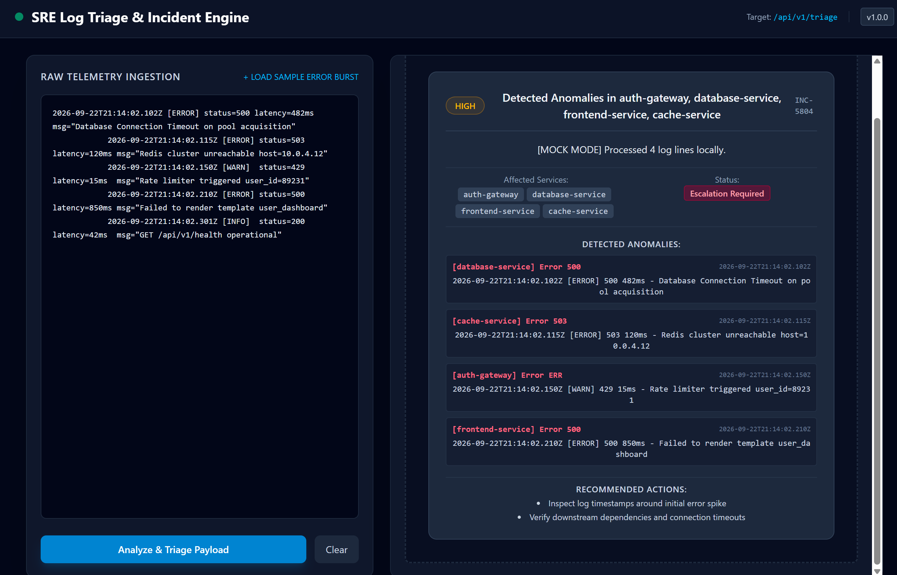

# 🛠️ AI Log Analyzer & Triage Engine

> **Status:** Active Development (Week 3 of 12 — AI-Augmented Velocity)  
> A modular, high-performance SRE incident triage pipeline and dashboard built with **FastAPI**, **HTMX**, **Tailwind CSS**, and **Pydantic**.

---

## 📸 System UI


*Figure 1: Real-time SRE Log Triage Dashboard rendering extracted anomalies, affected services, and recommended actions.*

---

## 🏗️ Architecture & Pipeline Flow

The system processes incoming log streams through a 4-stage pipeline before rendering real-time HTML fragments via HTMX:

```text
[ Raw Logs / Form Payload ]
            │
            ▼
┌──────────────────────────┐
│  Stage 1: Extraction     │  FastAPI Router & HTMX Form Unwrapper
└───────────┬──────────────┘
            │
            ▼
┌──────────────────────────┐
│  Stage 2: Parsing Engine │  Pre-compiled RegEx & ISO-8601 Extractor
└───────────┬──────────────┘
            │
            ▼
┌──────────────────────────┐  TRIAGE_MODE Routing:
│  Stage 3: LLM Analysis   │  ├── mock   -> Heuristic / Regex Fallback
└───────────┬──────────────┘  ├── ollama -> Local Llama 3.2 (Offline)
            │                 └── openai -> GPT-4o Tool-Calling
            ▼
┌──────────────────────────┐
│  Stage 4: UI Rendering   │  Pydantic Schema Validation & HTMX Fragment Swap
└──────────────────────────┘
```

---

## 🚀 Performance Benchmarks

Refactored using AI-assisted workflows (Cursor) to eliminate $O(N^2)$ search patterns and inline RegEx compilation:

| Metric | Baseline (Legacy) | Refactored | Improvement |
| :--- | :--- | :--- | :--- |
| **50,000 Logs Processing** | 57.93s | 0.11s | **~496x Faster** |
| **Throughput (Ops/Sec)** | ~38 ops/sec | ~523 ops/sec | **13.6x Increase** |

---

## 🧰 Tech Stack

- **Backend:** Python 3.11+, FastAPI, Pydantic v2, `python-dotenv`
- **Frontend:** HTMX, Tailwind CSS, Jinja2 / HTML Fragments
- **AI / LLM Integration:** OpenAI API (`gpt-4o`), Ollama (Local Llama 3.2), Fallback Heuristic Engine

---

## 🧪 Testing & Local Execution

This project can be run locally with Python.

### 1. Install Python

Install Python 3.11 or newer and verify that it is available:

```bash
python --version
```

On Windows, use `py --version` if the `python` command is not available.

### 2. Create a virtual environment

Run these commands from the repository root:

**Windows PowerShell**

```powershell
py -m venv .venv
.\.venv\Scripts\Activate.ps1
```

**Linux/macOS**

```bash
python3 -m venv .venv
source .venv/bin/activate
```

If PowerShell blocks activation, either use the direct Python path shown below or
allow scripts for the current user:

```powershell
Set-ExecutionPolicy -Scope CurrentUser RemoteSigned
```

### 3. Install dependencies

With the virtual environment activated, install the pinned dependencies:

```bash
python -m pip install --upgrade pip
python -m pip install -r requirements.txt
```

Using `python -m pip` ensures that packages are installed into the same Python
environment used to run the application. On Windows, the commands can also be run
without activation:

```powershell
.\.venv\Scripts\python.exe -m pip install -r requirements.txt
```

### 4. Run the API and dashboard

Start the development server:

```bash
python -m uvicorn src.main:app --reload
```

Then open <http://127.0.0.1:8000> in a browser. The application provides:

- Dashboard: <http://127.0.0.1:8000>
- Health check: <http://127.0.0.1:8000/api/v1/health>
- Interactive API documentation: <http://127.0.0.1:8000/docs>
- Triage endpoint: `POST /api/v1/triage`

The default `TRIAGE_MODE` is `mock`, so the dashboard can analyze logs immediately
using the local heuristic analyzer.

### 5. Run the command-line demo

In a second terminal, activate the same virtual environment and run:

```bash
python run_triage.py
```

### 6. Run the tests

```bash
python -m pytest
```

### Optional: configure an LLM provider

Copy or edit the root `.env` file and set one of the supported modes:

```dotenv
TRIAGE_MODE=mock
```

For OpenAI, set `TRIAGE_MODE=openai` and provide `OPENAI_API_KEY`. For Ollama, set
`TRIAGE_MODE=ollama`, start Ollama locally, and optionally set `OLLAMA_MODEL` and
`OLLAMA_BASE_URL`. The application falls back to local mock analysis if an external
LLM request fails.
